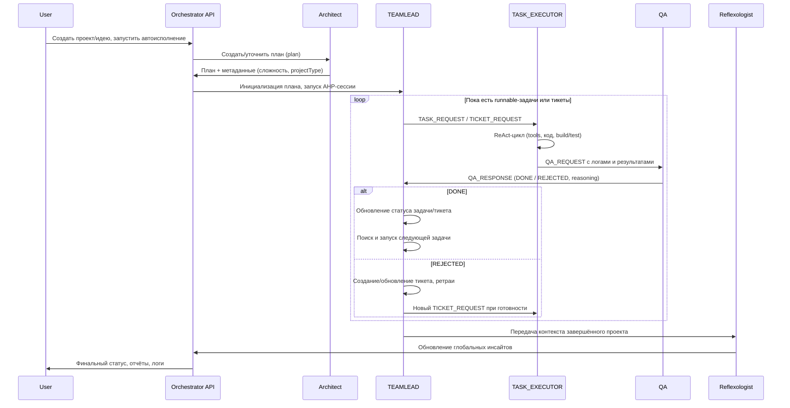

## devoslav — архитектура системы

### 1. Назначение и общая картина

**devoslav** — многоагентная система автоматизированной разработки, которая:
- принимает идеи/задачи от пользователя;
- превращает их в план (plan) и набор связанных задач (tasks);
- исполняет задачи через специализированных агентов;
- жёстко контролирует качество через QA и тикеты;
- использует память (RAG/insights) и логи прошлых сессий для самокоррекции.

На верхнем уровне система состоит из:
- **Web‑приложения** (Next.js App Router) с API‑роутами;
- **PostgreSQL + pgvector** (основные данные и векторное хранилище);
- **Execution workspace** для каждого проекта (директория с исходниками);
- **Набора AI‑агентов**, работающих асинхронно по протоколу AHP;
- **Контейнерного окружения** для запуска сборок/тестов проектов;
- **Мониторинга** (Beszel) для наблюдения за контейнерами/ресурсами.

```mermaid
flowchart LR
  User((User/IDE))
  UI[Next.js UI<br/>App Router]
  API[Next.js API Routes]
  DB[(Postgres + pgvector)]
  Workspace[/Project Workspace/]
  Agents[AI Agents<br/>(TEAMLEAD, EXECUTOR, QA, CSS, Reflexologist, Architect)]
  LLMs[(LLM Providers)]
  Monitor[Beszel Monitoring]

  User --> UI --> API
  API --> DB
  API --> Workspace
  API --> Agents
  Agents --> DB
  Agents --> Workspace
  Agents --> LLMs
  API --> Monitor
```

---

### 2. Agent Hive Protocol (AHP)

**AHP** — это протокол многоагентного взаимодействия через **централизованный Message Bus**, реализованный поверх таблиц БД (agentMessage, executionSession и др.).

- Каждый агент имеет **роль** (`AgentRole`) и обрабатывает только сообщения, адресованные этой роли.
- Сообщения имеют **тип события** (`MessageType`) и **статус** (`PENDING`, `PROCESSING`, `DONE`, `FAILED`).
- Агенты читают «свою» очередь сообщений, выполняют работу и сохраняют результат обратно в БД.
- Диспетчер AHP оркестрирует общий цикл, пока сессия не будет завершена.

Высокоуровневый вид AHP:

```mermaid
flowchart TB
  subgraph DB[Database]
    MB[Message Bus<br/>(AgentMessage)]
    ES[ExecutionSession]
    TK[Tickets]
    TS[Tasks]
  end

  Dispatcher[AHP Dispatcher]
  TL[TEAMLEAD]
  EX[TASK_EXECUTOR]
  QA[QA]
  CSS[CSS]
  RX[Reflexologist]
  AR[Architect]

  Dispatcher --> MB
  TL --> MB
  EX --> MB
  QA --> MB
  CSS --> MB
  RX --> MB
  AR --> MB

  MB --> TL
  MB --> EX
  MB --> QA
  MB --> CSS
  MB --> RX
  MB --> AR
```

**Execution Session**:
- каждая автоматическая сессия исполнения (autopilot) описывается сущностью `executionSession`;
- к сессии привязаны: проект, необязательный план, настройки (provider/model, autoApprove и пр.), журналы исполнения;
- AHP‑диспетчер крутится в цикле, пока сессия не выполнит все задачи и не закроет связанные тикеты.

---

### 3. Основные агенты и их роли

#### 3.1. Общая модель агента

Все агенты наследуются от общей абстракции:
- имеют **конфигурацию** (sessionId, projectId, agentRole, режим `local|cloud`);
- читают из Message Bus все отложенные для них сообщения;
- обрабатывают каждое сообщение и записывают результат/ошибку;
- могут отправлять сообщения другим ролям через Message Bus.

Это даёт единый жизненный цикл для всех ролей и единообразный логгинг.

#### 3.2. TEAMLEAD (оркестратор задач)

**Назначение**:
- управляет очередью задач в рамках плана;
- реагирует на результаты QA и стилизации;
- создаёт или обновляет баг‑тикеты;
- запускает следующую доступную задачу;
- триггерит быстрый архитектурный review после выполнения задач.

**Основные обязанности**:
- получает `ARCHITECT_REQUEST` и запускает быстрый `quickReview` по завершённой задаче;
- получает `QA_RESPONSE`:
  - если **DONE**:
    - с тикетом → закрывает тикет;
    - без тикета → ищет и запускает следующую доступную задачу плана;
  - если **REJECTED**:
    - при наличии тикета → управляет ретраями (до лимита), переоткрывает или окончательно помечает как `REJECTED`;
    - без тикета → создаёт новый ticket на исправление, вкладывая туда QA‑сводку и кусок девопс‑логов;
- получает `STYLE_RESPONSE` от CSS‑агента и сохраняет системный комментарий с рекомендациями/результатом стилизации;
- при отсутствии дальнейших задач объявляет завершение проекта.

#### 3.3. TASK_EXECUTOR (исполнитель задач)

**Назначение**:
- выполняет конкретные технические задачи по коду/конфигурации;
- работает в режиме ReAct‑цикла «мысль → действие → наблюдение»;
- использует набор инструментов (tools) для чтения/записи файлов, запуска команд, поиска по коду и по вебу;
- обязан довести build/tests до зелёного состояния перед завершением задачи.

**Ключевые аспекты**:
- обрабатывает сообщения типов:
  - `TASK_REQUEST` (основной сценарий);
  - `TICKET_REQUEST` (работа по баг‑тикету);
  - `STYLE_RESPONSE` (частные случаи переработки CSS — через отдельный CSS‑агент);
- строит и поддерживает историю ReAct‑шагов (Thought/Action/Observation) в текстовом виде;
- режет историю по лимиту контекста, сохраняя задачу и наиболее свежие наблюдения;
- ожидает и строго парсит JSON‑ответы модели вида: `{"thought": "...", "action": { "toolName": "...", "params": {...}}}` или `FINISH`;
- при ошибках разбора даёт модели стандартное сообщение с правилами и просит повторить;
- использует настройки LLM (provider/model, токены, таймауты) и трекинг использования;
- строго применяет правило: **нельзя завершить задачу, если последний build/test неуспешен**.

#### 3.4. QA агент

**Назначение**:
- проверяет результаты работы TaskExecutor‑а;
- сверяет артефакты, команды `automatedCheck` и указания по `manualCheck`;
- решает, считать задачу выполненной или отправить на доработку.

**Поведение**:
- анализирует логи сборки/тестов, состояние артефактов;
- формирует `QA_RESPONSE` с финальным статусом (`DONE` / `REJECTED`) и пояснением;
- этот ответ затем интерпретируется TeamLead‑агентом, который либо продолжает план, либо создаёт тикет.

#### 3.5. CSS агент

**Назначение**:
- занимается улучшением визуальной части (CSS/стилизация) по отдельным задачам;
- отдаёт улучшенный CSS/markup и reasoning.

**Интеграция**:
- отправляет `STYLE_RESPONSE`;
- TeamLead создаёт системный комментарий и передаёт улучшения в TaskExecutor для записи в файлы.

#### 3.6. Architect агент

**Назначение**:
- строит или уточняет архитектурный план на основе идеи/запроса;
- отвечает за разбиение проекта на план (plan) и за крупнозернистые технические решения;
- может запускаться повторно (quick review) после завершения задач, чтобы внести корректировки.

#### 3.7. Reflexologist (обучающая подсистема)

**Назначение**:
- анализирует прошлые сессии исполнения;
- извлекает неудачи и паттерны ошибок;
- создаёт/обновляет глобальные инсайты (RAG/векторное хранилище), чтобы система в будущем избегала тех же ошибок.

---

### 4. Жизненный цикл задачи и взаимодействие агентов

Упрощённый сценарий от идеи до фикса багов:



---

### 5. Execution Sessions и AHP‑диспетчер

**Execution Session Manager / AHP‑Dispatcher**:
- обрабатывает HTTP‑запросы на запуск сессии (например, `run-ahp`);
- создаёт или обновляет `executionSession` в БД;
- инициализирует рабочий каталог проекта (workspace) и контейнер;
- в цикле:
  - проверяет, завершена ли сессия (нет сообщений и нерешённых задач/тикетов);
  - читает pending/processing сообщения для всех агентов в рамках сессии;
  - если сообщений нет, ищет следующую runnable‑задачу или тикет;
  - при наличии — создаёт соответствующее `TASK_REQUEST` или `TICKET_REQUEST`;
  - по таймеру проверяет «зависание» сессии (долго нет новых логов) и, при необходимости, завершает сессию как застрявшую;
  - пишет подробные execution‑логи (в БД и в файловый лог сессии).

**Критерии завершения сессии**:
- нет ожидающих сообщений для агентов;
- в плане нет незавершённых задач И нет открытых тикетов с привязкой к задачам;
- либо достигнут лимит итераций/таймаут или сессия признана застрявшей.

---

### 6. Модель данных: проекты, планы, задачи, тикеты

Основные сущности в БД:
- **Project**:
  - базовая информация о проекте;
  - настройки LLM‑провайдера/модели;
  - связь с планами и execution‑сессиями.
- **Plan**:
  - результат работы Architect‑агента;
  - содержит заголовок, описание, оценку сложности, `projectType`;
  - связан с множеством **Task**.
- **Task**:
  - отдельная техническая единица работы;
  - поля: заголовок, описание, `executorAgent`, статус (`TODO`, `IN_PROGRESS`, `REVIEW`, `WAITING_APPROVAL`, `DONE`, `REJECTED` и пр.);
  - зависимость от других задач (граф зависимостей);
  - критерии верификации: `verificationCriteria.artifacts | manualCheck | automatedCheck`.
- **Ticket**:
  - баг‑тикеты, как правило связанные с конкретной задачей;
  - используются для учёта отказов QA и повторных попыток;
  - имеют статус (`OPEN`, `IN_PROGRESS`, `DONE`, `REJECTED`) и `retryCount`.
- **AgentMessage**:
  - сообщения между агентами в рамках AHP;
  - содержат отправителя, получателя (роль), тип события, полезную нагрузку, статус.
- **ExecutionLog**:
  - построчные логи сессии;
  - используются и AHP‑диспетчером (детект зависаний), и UI‑консолью.

---

### 7. Контекст проекта и workspace

**Контекст проекта**:
- для каждой задачи формируется компактный контекст проекта (`getCompactProjectContext`);
- контекст включает:
  - структуру файлов/директорий;
  - ключевые конфиги/файлы (package.json, конфиги сборки, README);
  - состояние задач/плана;
  - при необходимости — выборки из глобальных инсайтов (RAG).

**Workspace**:
- для каждого проекта есть отдельная директория, где живёт код;
- при запуске сессии workspace:
  - инициализируется (создаются нужные папки/файлы, синхронизируется состояние);
  - подключается внутрь контейнера, в котором TaskExecutor запускает команды (build/test/linters);
  - все изменения кода выполняются через инструменты агента внутри этого workspace.

---

### 8. Работа с LLM‑провайдерами

Система поддерживает несколько провайдеров:
- OpenAI (по умолчанию);
- OpenRouter;
- Z.ai;
- Qwen (через DashScope совместимый API).

Выбор провайдера/модели:
- глобальные настройки (env, `AI_PROVIDER`, `AI_MODEL`);
- переопределения на уровне проекта;
- потенциальные переопределения на уровне конкретного задания/плана.

Каждый вызов LLM:
- выполняется через единый слой провайдеров (resolveProvider, getModel, callWithRetries);
- учитывает таймауты и лимиты токенов;
- логируется для учёта использования (trackAIUsage).

---

### 9. QA, верификация и артефакты

Верификация строится по принципу **Goal‑Backward Verification**:
- при генерации задач заранее формируются критерии:
  - **artifacts** — какие файлы/пути должны появиться или измениться;
  - **manualCheck** — как человек проверит результат;
  - **automatedCheck** — какую команду нужно запустить (build/test/композитная команда).

QA‑агент:
- сопоставляет фактическое состояние проекта и критерии задачи;
- проверяет успешность `automatedCheck`;
- формирует ясное резюме причины успеха/отказа;
- инициирует повторные циклы через TeamLead и тикеты.

TaskExecutor обязан:
- не завершать работу по задаче, пока `automatedCheck` не проходит;
- аккуратно логировать причины провалов и свои следующиe шаги.

---

### 10. Мониторинг и эксплуатация

**Инфраструктура (docker-compose)**:
- сервис приложения (Next.js API + UI, порт 3002 → контейнер 3000);
- Postgres/pgvector (порт 5433);
- Adminer (порт 8081) для ручной работы с БД;
- Beszel + Beszel Agent (порт 8085 и socket Docker) для мониторинга контейнеров и ресурсов;
- миграционный сервис Prisma для первичной инициализации схемы БД.

**Мониторинг**:
- Beszel показывает состояние контейнеров (нагрузка, память, перезапуски и т.д.);
- Execution logs в БД и файловой системе дают подробную трассировку каждой сессии;
- UI содержит консоль исполнения и представление логов агентов.

---

### 11. Ограничения и будущие расширения

Текущие ограничения (в духе, как система сейчас спроектирована):
- ориентация на один workspace‑проект на сессию;
- завязка на Docker‑окружение для «честного» выполнения build/test;
- строгое следование ReAct‑циклу и JSON‑протоколу — любые отклонения от формата требуют доп. логики восстановления.

Потенциальные направления развития:
- горизонтальное масштабирование AHP‑диспетчера и агентов;
- поддержка распределённых воркеров и очередей (например, поверх Kafka/RabbitMQ);
- более глубокая интеграция RAG (персонализированные insights на уровне проектов/команд);
- расширение набора ролей агентов (Security, Performance, Docs и др.).

